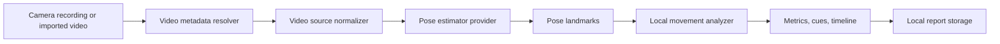

# MoveBeta Architecture

## Goal

Build a modular mobile app that analyzes climbing movement on-device, keeps raw video local by default, and can swap pose
estimation providers without changing the product screens.

## Layers

| Layer | Responsibility |
| --- | --- |
| `src/app` | Navigation entry points for coach, sessions, drills, progress, and privacy |
| `src/features` | Screen-level composition and product workflows |
| `src/components` | Reusable visual components |
| `src/core` | Configuration, haptics, theme tokens |
| `src/video` | Video capture/import normalization, metadata resolution, intake readiness, and source defaults |
| `src/movement/contracts.ts` | Typed schemas for videos, landmarks, sessions, metrics, cues, and reports |
| `src/movement/onDevicePipeline.ts` | Provider selection and local analysis orchestration |
| `src/movement/localAnalyzer.ts` | Deterministic coaching rule engine |
| `src/movement/reportRepository.ts` | Report persistence contract with native SQLite and web/local fallbacks |
| `src/movement/coachConsentRepository.ts` | Per-report coach consent persistence with web/local and native SQLite adapters |

## On-Device Flow

The app now supports `camera` and `import` video sources in the UI. Web builds try `web-tfjs-movenet`, which loads
TensorFlow.js MoveNet in the browser and extracts normalized landmarks from local video frames. Native builds can use
`native-platform-pose`, the local Expo module backed by Apple Vision on iOS and ML Kit Pose Detection on Android.
Unsupported runtimes or decode failures fall back to `local-video-fallback`, which keeps the workflow runnable without
uploading video. Production native builds keep the same `PoseEstimator` interface and replace only the provider
implementation.

MoveNet loading remains lazy inside the active browser session, but the graph and weight shards are no longer fetched
from TensorFlow Hub during first user analysis. `npm run model:movenet:assets:download` vendors MoveNet SinglePose
Lightning under `public/models/movenet/singlepose/lightning/4`, writes `public/model-assets.json`, and normalizes the
local `model.json` to same-origin shard paths. `app.json` and `.env.example` expose the replaceable
`tfjsMoveNetModelUrl`, while `public/sw.js` precaches `/model-assets.json` plus every listed `/models/...` file. The
download point is build/setup time; the runtime detector loads from the app origin and can reuse the service-worker cache
when the PWA has been installed or opened online once.
`scripts/prepare_pwa_dist.mjs` also injects the exported Expo JS bundles, router image assets, and metadata into
`dist/sw.js`, so the generated service worker has a deterministic offline app-boot cache instead of relying on a second
controlled reload to discover hashed files.
`npm run model:assets:provenance` adds the release evidence layer for those vendored assets: source URL checks,
same-origin inventory checks, SHA-256 parity, attribution notice validation, and an explicit license-review state.

`src/video/videoMetadata.ts` resolves duration and dimensions before source normalization. Custom native builds read
metadata through `movebeta-pose`; web preview can use browser video metadata; unsupported runtimes fall back to
picker/timer/default values without blocking analysis. The recorder uses a configurable muted profile so movement
analysis does not need microphone permission or stored audio.

Before analysis, `src/video/videoIntake.ts` checks that the selected clip is local, long enough for the sampler,
reasonable for on-device processing, and high enough resolution to keep hands, hips, and feet visible. Blocking issues
stop analysis before provider execution; warnings remain visible so users can still analyze borderline clips.
`src/video/performanceBudget.ts` keeps analysis latency budgets outside product screens and writes elapsed time,
budget status, and frame rate into every pipeline report.

## Provider Strategy

- `local-fixture`: deterministic provider for bundled demos, tests, and design validation.
- `local-video-fallback`: deterministic provider for recorded/imported video workflows when native frame processors are
  unavailable.
- `web-tfjs-movenet`: browser provider backed by TensorFlow.js MoveNet SinglePose Lightning.
- `native-platform-pose`: first-party Expo module backed by Apple Vision and Android ML Kit.
- `native-mediapipe`: reserved adapter slot for MediaPipe Pose Landmarker; rejected clearly until implemented.
- `native-coreml`: reserved adapter slot for custom Core ML models; rejected clearly until implemented.
- `native-tflite`: reserved adapter slot for portable TensorFlow Lite models; rejected clearly until implemented.

## Native Adapter Contract

Providers must run on-device, return normalized landmarks, avoid raw video uploads, skip incomplete per-frame detections,
and fail clearly when the bridge or browser runtime is unavailable. Repository orchestration attempts the configured
video provider for real videos and falls back to `local-video-fallback` when the preferred provider reports unavailable
or cannot extract enough complete frames.

The native platform adapter lives in `modules/movebeta-pose` so native dependencies remain isolated from product screens.
Expo prebuild autolinks it into generated iOS/Android projects. The adapter also exposes local video metadata for
camera/import normalization. Android `:app:assembleDebug` has been verified locally; iOS source is ready for
CocoaPods/Xcode validation on a machine with full Xcode installed.

## Storage Strategy

The default persistence layer stores reports rather than raw video. React Native runtimes use `SQLiteReportRepository`
backed by Expo SQLite; web previews use `LocalReportRepository` with `localStorage`, and tests or unsupported runtimes
fall back to the same repository contract without blocking startup. A production sync layer can add encrypted cloud
replication later, but raw clips remain local unless the user explicitly exports or shares them.
Coach review consent follows the same storage strategy through `coachConsentRepository`, so the Sessions workflow can
grant, revoke, restore, and delete per-report consent records without uploading media or landmarks.

## Safety Boundaries

MoveBeta provides educational technique feedback. It must not claim medical diagnosis, injury prevention, or route safety.
Coach packet export requires explicit per-report athlete consent and still excludes raw video, URI, key-frame, and
landmark artifacts. Any future coach/team workspace needs durable consent records because filming in gyms can capture
other people.
Coach library export is derived from the privacy-safe library and team-template view models, then validated before handoff
so private notes, drill notes, frames, URIs, key frames, and landmarks do not enter the batch artifact.
