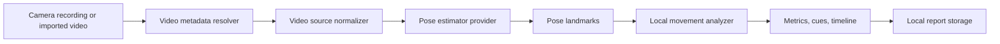

# MoveBeta Architecture

## Goal

Build a modular mobile app that analyzes climbing movement on-device, keeps raw video local by default, and can swap pose
estimation providers without changing the product screens.

## Layers

| Layer | Responsibility |
| --- | --- |
| `src/app` | Navigation entry points for coach, sessions, drills, progress, and privacy |
| `src/features` | Screen-level composition and product workflows |
| `src/components` | Reusable visual components |
| `src/core` | Configuration, haptics, theme tokens |
| `src/video` | Video capture/import normalization, metadata resolution, intake readiness, clip triage, analysis windows, and source defaults |
| `src/movement/contracts.ts` | Typed schemas for videos, landmarks, sessions, metrics, cues, and reports |
| `src/movement/onDevicePipeline.ts` | Provider selection and local analysis orchestration |
| `src/movement/localAnalyzer.ts` | Deterministic coaching rule engine |
| `src/movement/reportRepository.ts` | Report persistence contract with native SQLite and web/local fallbacks |
| `src/movement/coachConsentRepository.ts` | Per-report coach consent persistence with web/local and native SQLite adapters |

## On-Device Flow

The app now supports `camera` and `import` video sources in the UI. Web builds try `web-tfjs-movenet`, which loads
TensorFlow.js MoveNet in the browser and extracts normalized landmarks from local video frames. Native builds can use
`native-platform-pose`, the local Expo module backed by Apple Vision on iOS and ML Kit Pose Detection on Android.
Unsupported runtimes or decode failures fall back to `local-video-fallback`, which keeps the workflow runnable without
uploading video. Production native builds keep the same `PoseEstimator` interface and replace only the provider
implementation.
During recording, `src/video/liveRecordingGuide.ts` provides deterministic local filming prompts from capture
calibration, coach lens, elapsed time, minimum duration, and recording limit. This improves capture quality without
claiming real-time pose analysis or sending frames to a backend before the local analysis pipeline runs.

MoveNet loading remains lazy inside the active browser session, but the graph and weight shards are no longer fetched
from TensorFlow Hub during first user analysis. `npm run model:movenet:assets:download` vendors MoveNet SinglePose
Lightning under `public/models/movenet/singlepose/lightning/4`, writes `public/model-assets.json`, and normalizes the
local `model.json` to same-origin shard paths. `app.json` and `.env.example` expose the replaceable
`tfjsMoveNetModelUrl`, while `public/model-delivery-policy.json` declares when the web runtime should fetch model assets.
The default policy is `precache-on-install`: `public/sw.js` caches `/model-delivery-policy.json`, `/model-assets.json`,
and every listed `/models/...` file during first online service-worker install. The download point for vendoring remains
build/setup time; the user device fetches only same-origin model files and can reuse the service-worker cache when the PWA
has been installed or opened online once. The policy can be changed to warmup-only or lazy analysis download without
changing the pose-estimator contract.
`scripts/prepare_pwa_dist.mjs` also injects the exported Expo JS bundles, router image assets, and metadata into
`dist/sw.js`, so the generated service worker has a deterministic offline app-boot cache instead of relying on a second
controlled reload to discover hashed files.
The exported service worker cache version is content-addressed from app shell, Expo export, metadata, and static model
assets, which makes cache invalidation explicit when a shipped bundle or model file changes.
The model delivery lifecycle report surfaces that versioning as an Asset versioning stage and marks pending service-worker
updates as an action before offline analysis, so a returning installed PWA does not silently rely on stale cached model
files after a deploy.
The in-app PWA runtime readiness probe also checks Cache Storage for the model manifest and listed `/models/...` files,
separating generic offline app startup from offline model-analysis readiness.
When Web Crypto SHA-256 is available, runtime readiness also verifies cached model bytes against manifest digests before
declaring offline model analysis ready; browsers without Web Crypto fall back to cache-presence readiness without adding a
backend dependency.
The Plan tab Warm model action uses the same manifest to populate Cache Storage from same-origin model assets and emits a
share-safe warmup result, keeping cache warming explicit and testable. The same path verifies cached byte counts and
SHA-256 digests through browser Web Crypto when available, so offline model readiness can report both cache presence and
integrity without a backend.
The Coach tab reuses the same browser-runtime helpers through a local model preflight panel before capture. It shows
cached/verified model asset counts, exposes Warm model next to record/import, allows online real-video analysis to fetch
same-origin assets, blocks offline real-video analysis when the cache is missing, and bypasses browser cache checks for
native provider builds. The pure preflight contract also returns `shouldWarmBeforeAnalysis`, so online uncached real-video
analysis can warm `/model-assets.json` and listed `/models/...` files before the local pose provider starts, while offline
uncached real-video analysis remains blocked.
Coach workflow lock state is derived by `src/features/coach/coachWorkflowState.ts`, so warmup, analysis, and recording
phases share one disabled-state and action-label contract across analyze, record, import, metadata, calibration, and lens
controls.
`src/video/analysisResourcePlan.ts` provides the Coach intake resource planner. It uses the selected analysis window,
configured sampler frame limits, runtime budget thresholds, and decode-surface thresholds to classify local workload
before the model runs, then serializes only numeric/video-type metadata in a share-safe packet.
`src/core/analysisExecutionPlan.ts` sits above intake, triage, PWA model preflight, and resource planning. It produces a
single local execution checklist for Coach, including blocked, review, warmup-required, and ready states without carrying
raw video URIs or media references into shareable evidence.
`src/core/analysisDeviceReadiness.ts` and `src/core/analysisDeviceReadinessBrowser.ts` provide a device-signal preflight
for on-device analysis. Web builds read optional coarse browser signals such as Battery API, hardware concurrency, device
memory, and storage estimate; native builds use an explicit native fallback until platform-specific battery or thermal
adapters are added. The exported packet keeps only coarse runtime signals and negative privacy flags.
The Plan tab also derives `src/core/modelDownloadPlan.ts` from lifecycle and runtime readiness, separating packaged native
model delivery from PWA model download planning. The plan reports additional bytes, network preference, update activation,
cache warmup, integrity, and offline-use steps as a share-safe packet.
Coach PWA preflight treats `updateAvailable` as a stale-model guard for real videos: offline analysis is blocked until
the installed PWA refreshes and rewarms model assets, while online analysis keeps a visible refresh requirement and can
still trigger the same-origin warmup path when assets are uncached.
The PWA runtime action path uses `src/core/pwaUpdateActivation.ts` and `activateBrowserPwaUpdate()` to request activation
from a waiting service worker through a `MOVEBETA_SKIP_WAITING` message. The action returns a share-safe packet and then
refreshes runtime/cache state so the user can warm model assets against the active app version.
`src/core/pwaFieldReadiness.ts` aggregates runtime readiness and the model download plan into a field-use checklist for
offline real-video analysis. It keeps install/runtime, service-worker, model-cache, update-state, and offline-video
decisions in one schema-versioned packet, with pending PWA updates treated as blockers rather than advisory copy.
`npm run model:assets:provenance` adds the release evidence layer for those vendored assets: source URL checks,
same-origin inventory checks, SHA-256 parity, attribution notice validation, and an explicit license-review state.
The MoveNet readiness and smoke commands also resolve `public/model-assets.json` and load the vendored graph/shards
through a local TensorFlow.js IOHandler when the assets are present, so release checks prove the shipped model path
without depending on TensorFlow Hub availability.
`npm run model:delivery:lifecycle` and the Plan tab Model delivery lifecycle card turn that architecture into a
share-safe operational view: build-time vendoring, app-origin browser fetch on first online launch or warmup, and
offline reuse from Cache Storage are tracked as separate stages. Native builds use the same lifecycle contract but report
their model delivery mode as app-bundled instead of browser Cache Storage.

`src/video/videoMetadata.ts` resolves duration and dimensions before source normalization. Custom native builds read
metadata through `movebeta-pose`; web preview can use browser video metadata; unsupported runtimes fall back to
picker/timer/default values without blocking analysis. The recorder uses a configurable muted profile so movement
analysis does not need microphone permission or stored audio.

Before analysis, `src/video/videoIntake.ts` checks that the selected clip is local, long enough for the sampler,
reasonable for on-device processing, and high enough resolution to keep hands, hips, and feet visible. Blocking issues
stop analysis before provider execution; warnings remain visible so users can still analyze borderline clips.
`src/video/clipTriage.ts` turns the intake result into a local analyze, trim, retake, or blocked plan with configurable
score penalties, reasons, processing budget labels, target length, and privacy-safe output for the Coach intake panel.
`src/video/analysisWindow.ts` adds source-relative full, early, middle, and late sampling windows for long clips. The
window is stored as optional metadata on `VideoAsset`, does not alter the raw URI or source file, and is respected by the
browser MoveNet provider, native platform provider, and deterministic fallback provider before frames reach the analyzer.
The movement pipeline persists the effective window into `LocalAnalysisReport.engine.analysisWindow`, and
`src/movement/analysisEvidence.ts` adds a share-safe Analysis window evidence step so exported evidence can show what was
processed without raw media references, landmarks, or key frames.
`src/video/performanceBudget.ts` keeps analysis latency budgets outside product screens and writes elapsed time,
budget status, and frame rate into every pipeline report using the active analysis-window duration.

## Provider Strategy

- `local-fixture`: deterministic provider for bundled demos, tests, and design validation.
- `local-video-fallback`: deterministic provider for recorded/imported video workflows when native frame processors are
  unavailable.
- `web-tfjs-movenet`: browser provider backed by TensorFlow.js MoveNet SinglePose Lightning.
- `native-platform-pose`: first-party Expo module backed by Apple Vision and Android ML Kit.
- `native-mediapipe`: reserved adapter slot for MediaPipe Pose Landmarker; rejected clearly until implemented.
- `native-coreml`: reserved adapter slot for custom Core ML models; rejected clearly until implemented.
- `native-tflite`: reserved adapter slot for portable TensorFlow Lite models; rejected clearly until implemented.

## Native Adapter Contract

Providers must run on-device, return normalized landmarks, avoid raw video uploads, skip incomplete per-frame detections,
and fail clearly when the bridge or browser runtime is unavailable. Repository orchestration attempts the configured
video provider for real videos and falls back to `local-video-fallback` when the preferred provider reports unavailable
or cannot extract enough complete frames.

The native platform adapter lives in `modules/movebeta-pose` so native dependencies remain isolated from product screens.
Expo prebuild autolinks it into generated iOS/Android projects. The adapter also exposes local video metadata for
camera/import normalization. Android `:app:assembleDebug` has been verified locally; iOS source is ready for
CocoaPods/Xcode validation on a machine with full Xcode installed.

## Storage Strategy

The default persistence layer stores reports rather than raw video. React Native runtimes use `SQLiteReportRepository`
backed by Expo SQLite; web previews use `LocalReportRepository` with `localStorage`, and tests or unsupported runtimes
fall back to the same repository contract without blocking startup. A production sync layer can add encrypted cloud
replication later, but raw clips remain local unless the user explicitly exports or shares them.
Coach review consent follows the same storage strategy through `coachConsentRepository`, so the Sessions workflow can
grant, revoke, restore, and delete per-report consent records without uploading media or landmarks.

## Safety Boundaries

MoveBeta provides educational technique feedback. It must not claim medical diagnosis, injury prevention, or route safety.
Coach packet export requires explicit per-report athlete consent and still excludes raw video, URI, key-frame, and
landmark artifacts. Any future coach/team workspace needs durable consent records because filming in gyms can capture
other people.
Coach library export is derived from the privacy-safe library and team-template view models, then validated before handoff
so private notes, drill notes, frames, URIs, key frames, and landmarks do not enter the batch artifact.
