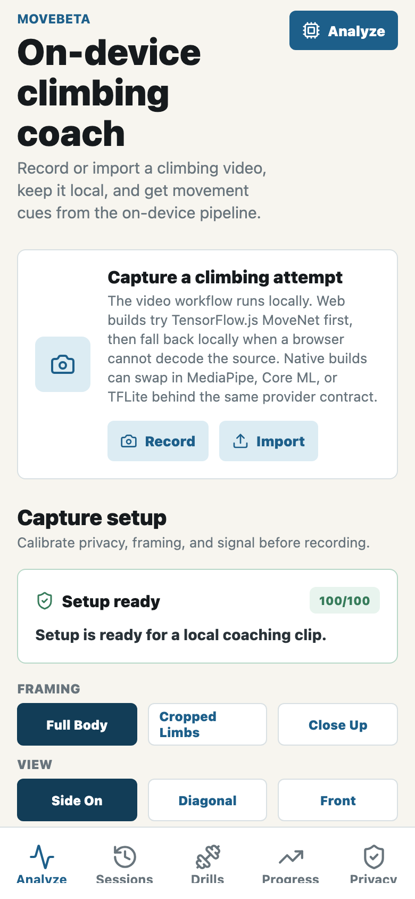
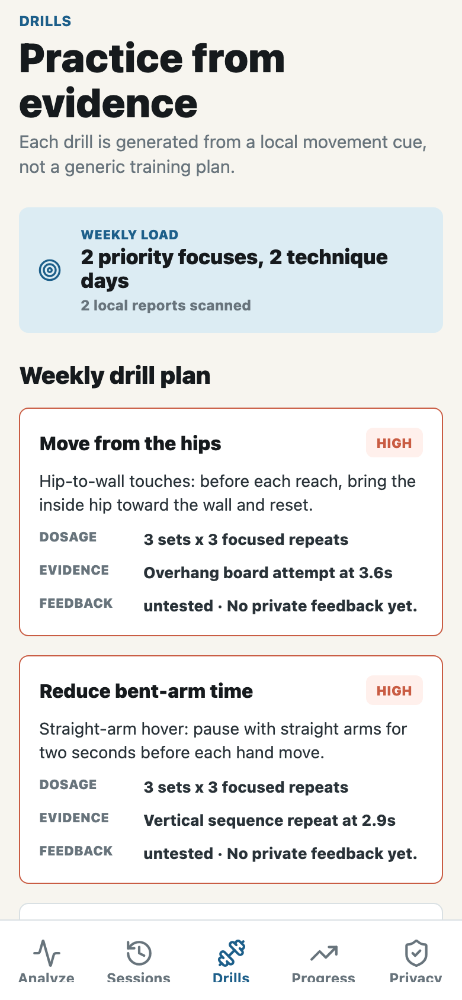
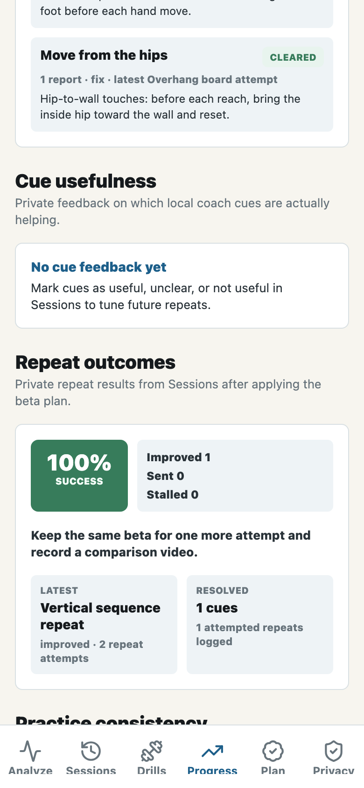
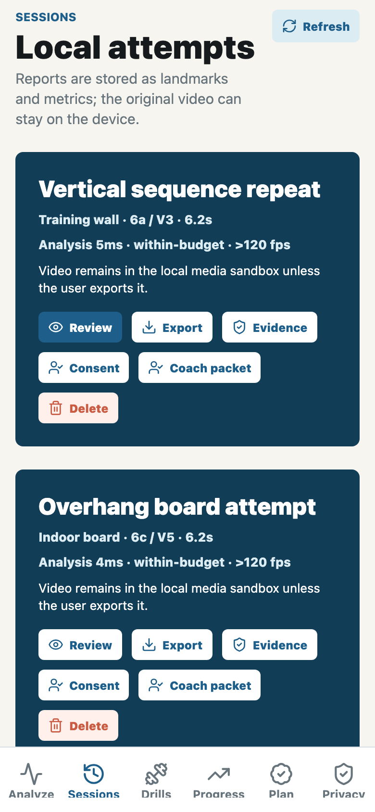
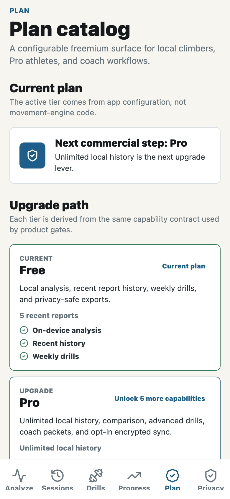
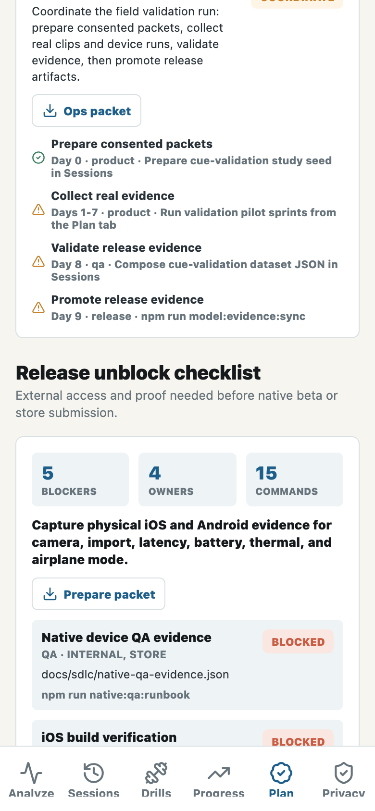
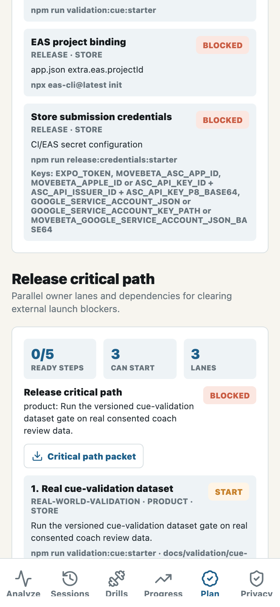
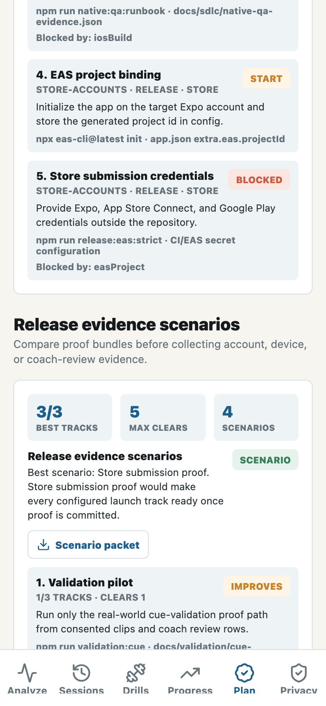
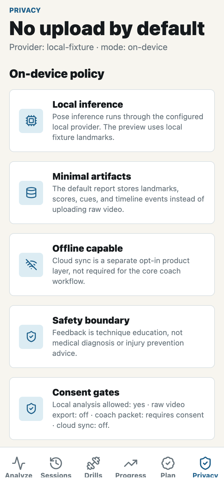
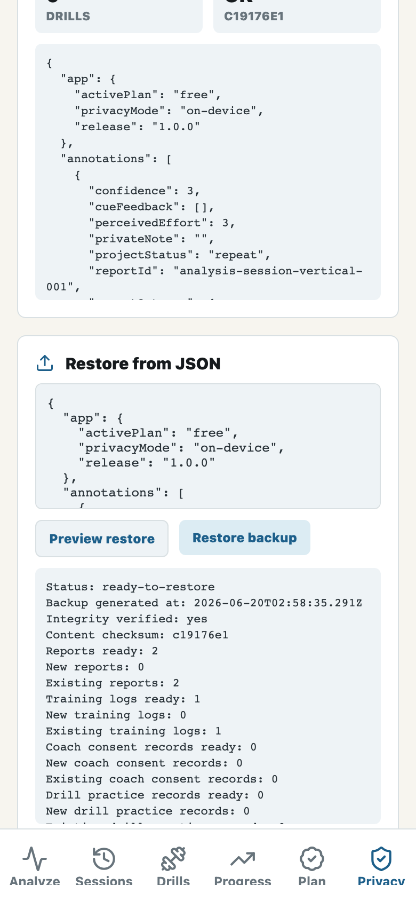

# MoveBeta Screenshots

These screenshots are generated from the exported web build with `npm run store:screenshots`.

## Analyze

## Drills

## Progress

## Sessions

## Plan

## Release Unblock

## Release Critical Path

## Release Evidence Scenarios

## Privacy

## Data Portability

