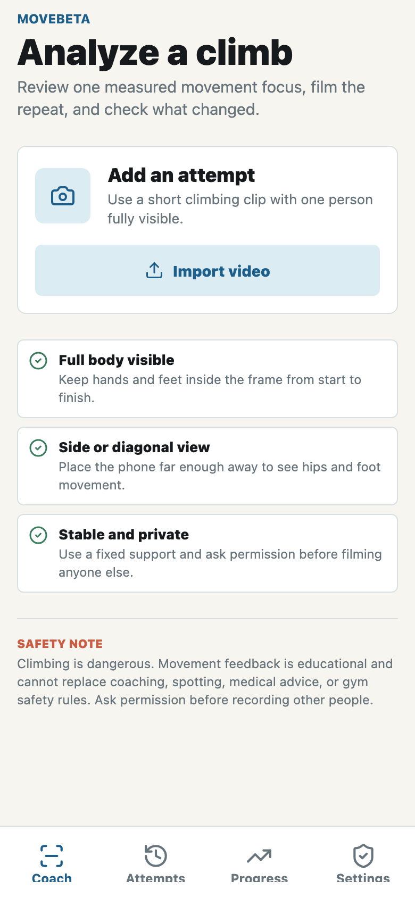
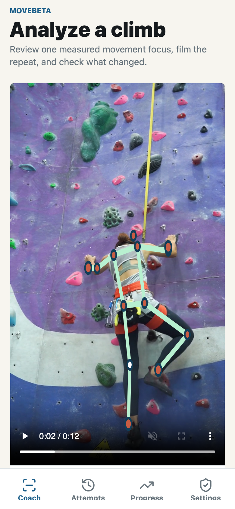
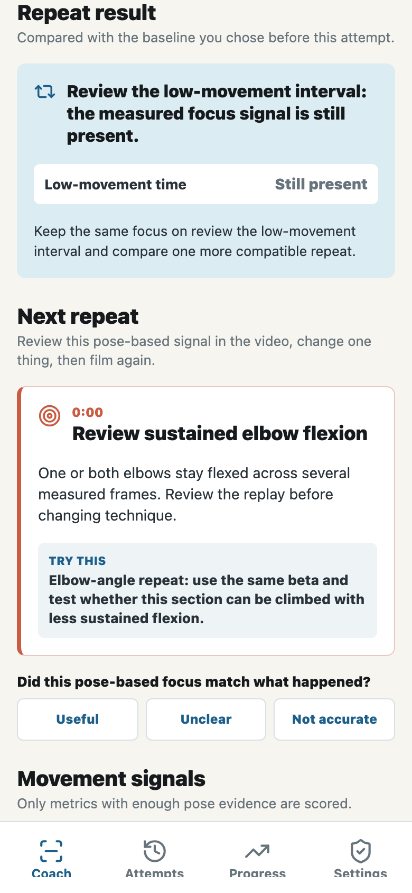
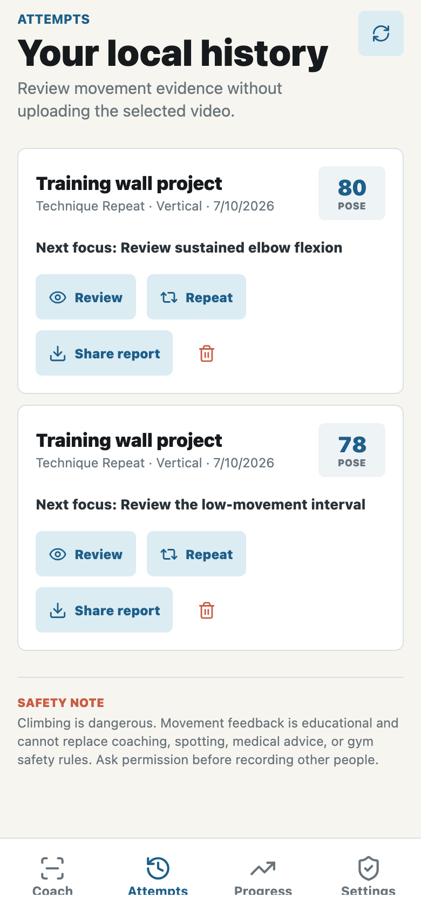
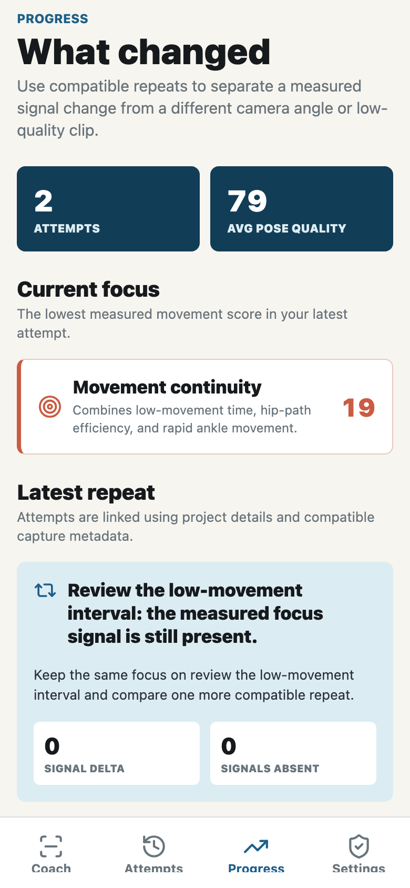
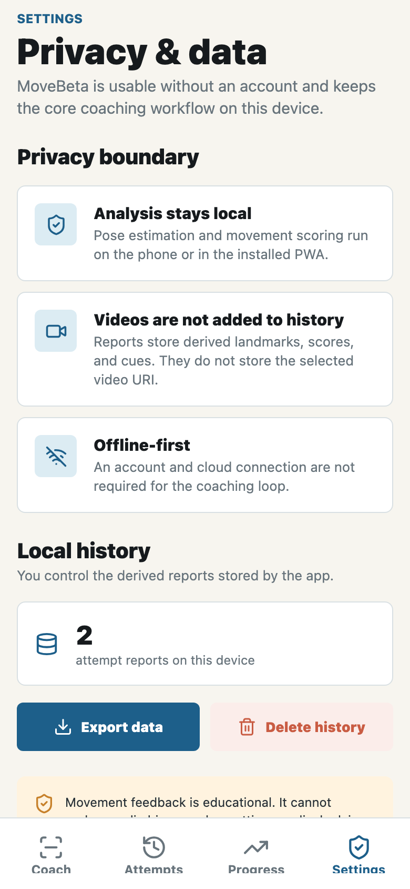

# MoveBeta Screenshots

These screenshots are generated from the exported consumer PWA with the licensed climbing fixture documented in
[`store/screenshot-plan.md`](store/screenshot-plan.md). The fixture is processed in the browser and is not committed.

## Coach

## Pose Analysis

## Focused Repeat

## Attempts

## Progress

## Settings

